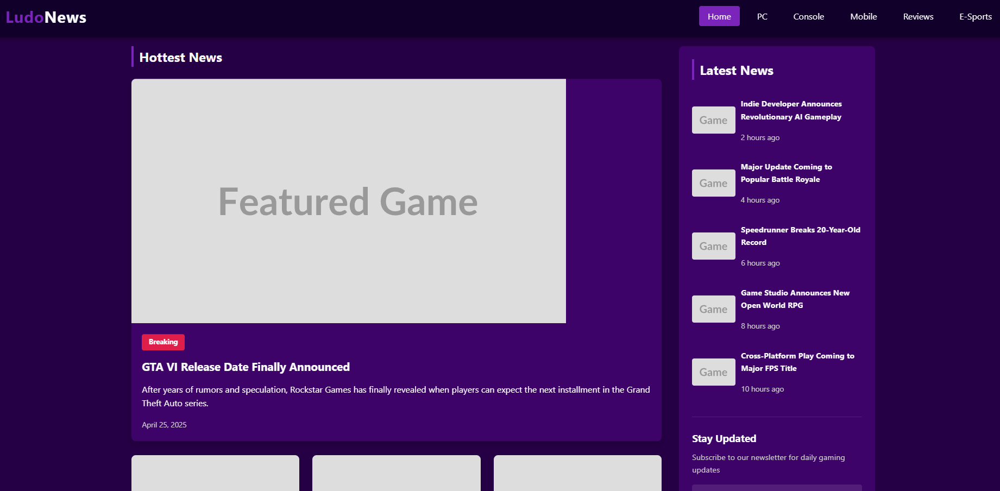
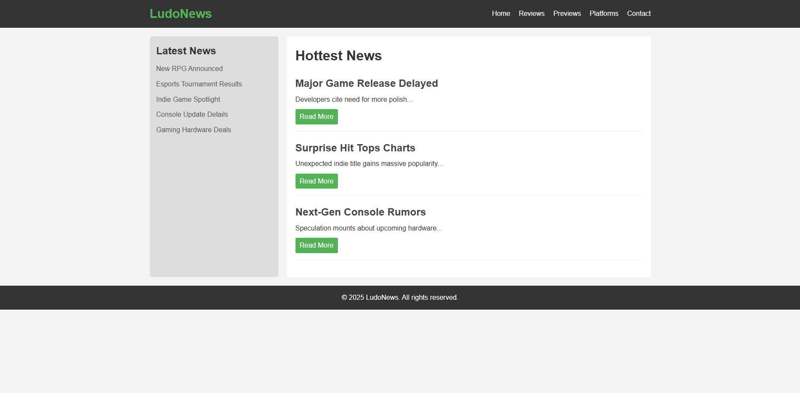
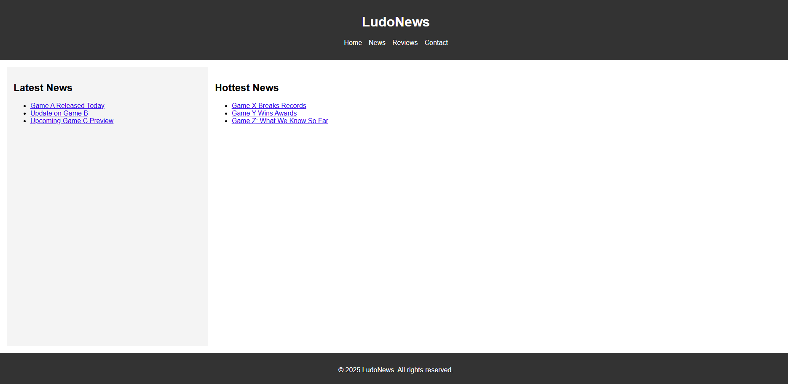
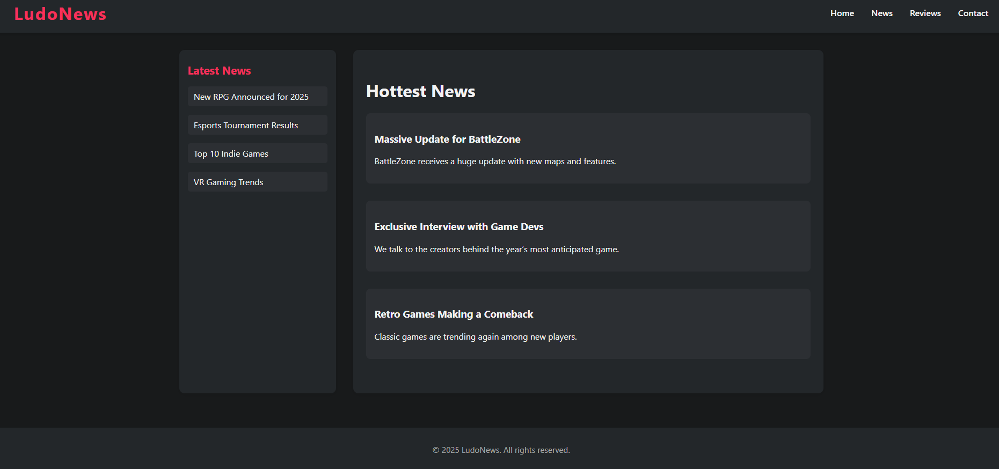

# GithubModelsWebdesign

This repository contains a simple html templates created by four different models available in Github Copilot.

## Testing Procedure

Four different models available in Github Copilot:

- GPT 4o (default model)
- GPT 4.1
- Gemini 2.5 Pro
- Claude 3.7 Sonnet

has been asked about creating a simple html template for main page of news service using following prompt:

```
create a responsive html main page for gaming news website named ludonews, page should contains simple menu, sidebar with latest news, list with hottest news and footer, create html and css in separated files in folder [name of models], use css animations
```

Extended thinking feature was disabled for all of models.

## Test Results

The models created following designs:

### Claude 3.7 Sonnet



### Gemini 2.5 Pro



### GPT 4o



### GPT 4.1

